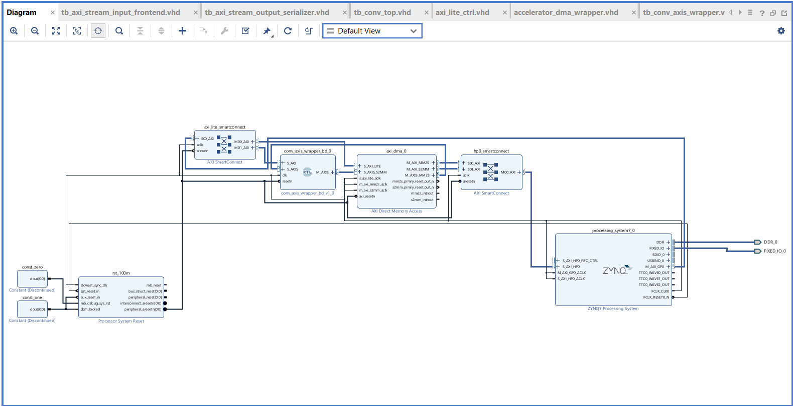
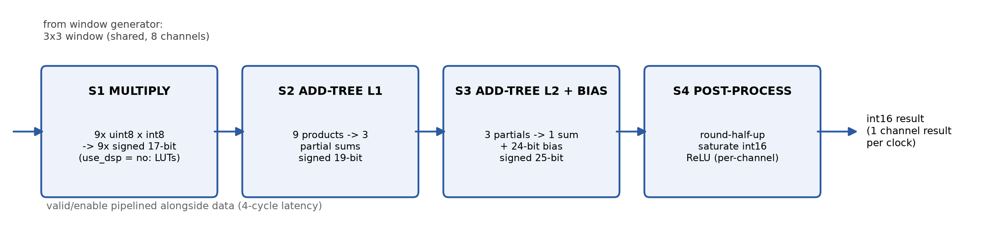
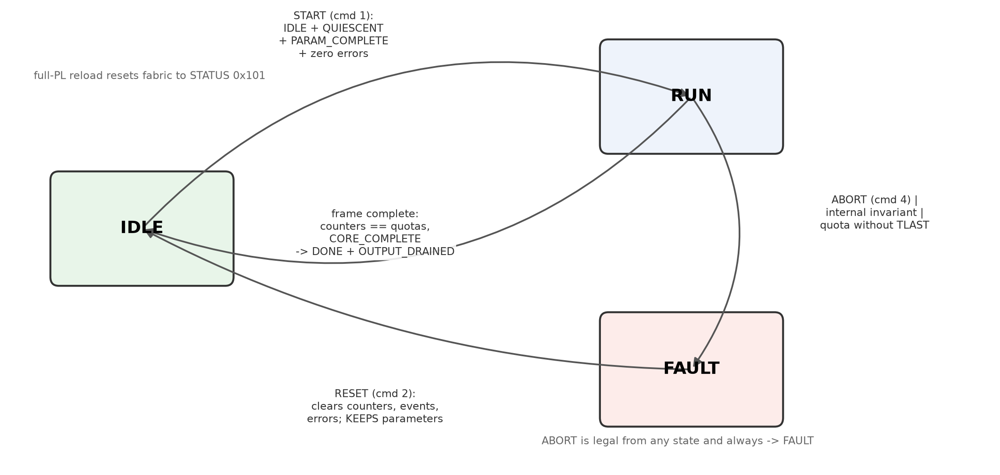
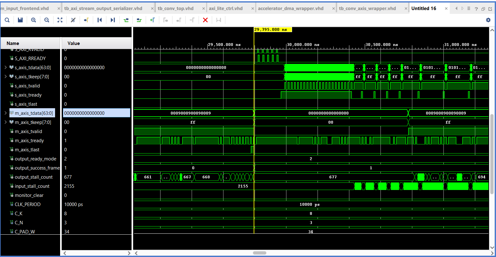
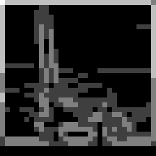
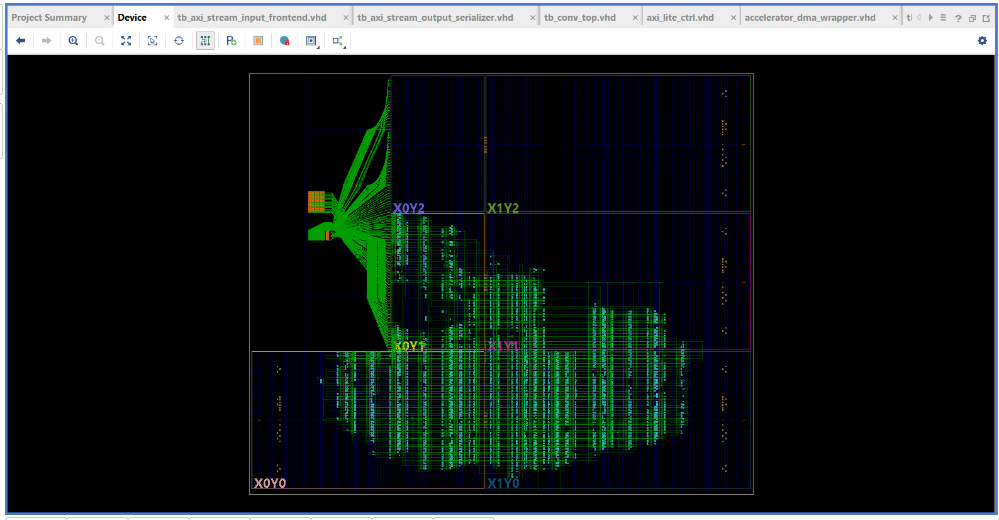
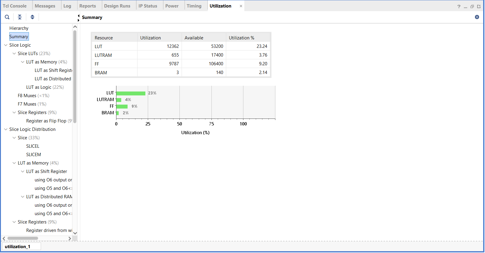
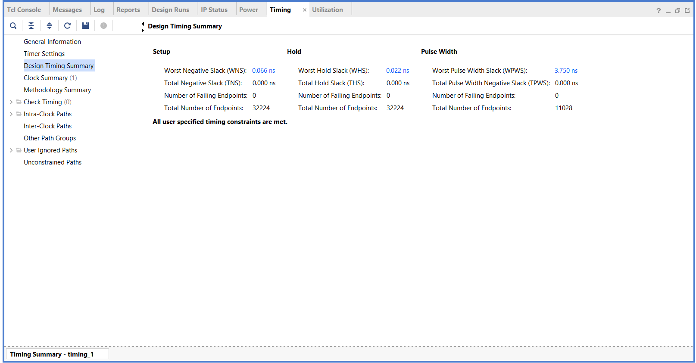

# FPGA CNN Convolution Accelerator for Edge-AI Vision

**Team submission — IEEE SSCS Egypt 2026 Student Design Competition**
Target platform: Digilent ZedBoard (Xilinx Zynq-7020 XC7Z020CLG484-1) · Toolchain: AMD/Xilinx Vivado 2025.2 · RTL: VHDL-2008

> **Source-index convention:** every numeric claim in this report carries a citation
> `[S#]` resolving to the Source Index (§13). All cited files are in the submission
> package or the project repository. No value in this report is assumed; derivations
> are marked "(derived)" and show their inputs.

---

## 1. Introduction

This report presents a fixed-point NxN convolution accelerator for the first
convolutional layer (Conv1) of a grayscale CNN, implemented on a Xilinx Zynq-7020
SoC. The design streams a 32×32 8-bit grayscale image over AXI4-Stream through an
AXI DMA, computes a stride-1, same-mode (zero-padded) 3×3 convolution against K
programmable channels (K=8 in the baseline profile A32; five compiled profiles up
to K=16 and 640×480 — §10.1), and streams signed 16-bit feature maps back to DDR
memory. All arithmetic is bit-exact against an arbitrary-precision Python golden
model, and the complete hardware-software system has been qualified on physical
silicon with more than 870 transcript-recorded bit-exact inference frames across
five compiled hardware profiles [S5]–[S8], [S16]–[S18].

The work was performed against the competition specification [S12]: minimum 32×32
grayscale input, unsigned fixed-point pixels, programmable 8-bit signed kernels,
stride 1, ≥16-bit signed outputs, golden-model verification, and reporting of
utilization, timing, latency, throughput, power, and Figure of Merit.

## 2. System architecture

The block design (`accelerator_dma`) instantiates:

- **Zynq PS7** — Cortex-A9 dual-core, DDR3 controller, and the AXI interfaces
  (M_AXI_GP0 control plane, S_AXI_HP0 high-throughput memory port).
- **AXI DMA** — simple mode (no scatter-gather), 64-bit on both memory sides,
  22-bit transfer-length configuration, no datatype re-alignment (DRE) [S10: BD + scripts/create_accelerator_dma_bd.tcl].
- **The accelerator** — a module reference wrapping the VHDL design (§3), exposed
  as AXI4-Lite slave + one 64-bit AXI4-Stream slave (pixels in) + one 64-bit
  AXI4-Stream master (results out).
- **Two AXI SmartConnects** (control and HP0), **proc_sys_reset**, and a single
  100 MHz clock domain derived from FCLK_CLK0 [S10].

Address map (from the scripted BD, reproducible via `scripts/create_accelerator_dma_bd.tcl`
and frozen in `software/hardware.json` [S9]): DMA `0x40400000`/64 KiB, accelerator
`0x43C00000`/64 KiB, HP0 → DDR `0x00000000`/512 MB.

*Figure 1 — Block design `accelerator_dma` in Vivado 2025.2 [screenshot, user capture].*

**Data flow:** PS writes channel parameters and the CVH1 control ABI over AXI4-Lite;
PS arms the DMA S2MM (receive) channel; PS writes TX length to trigger; pixels stream
DMA → accelerator → sliding-window generator → 8 parallel convolution channels →
output packer → DMA → DDR; PS polls CVH1 status for frame completion and verifies
the received buffer.

## 3. Convolution datapath and pipeline

The compute core (`conv_channel.vhd` [S10]) is a 4-stage pipeline computing one
output feature-map pixel per clock once the pipeline is filled:

| Stage | Function | Width |
|---|---|---|
| S1 MULTIPLY | 9 unsigned(8)×signed(8) products per channel | 17-bit signed products |
| S2 ADD-TREE L1 | 9 products → 3 partial sums | 19-bit |
| S3 ADD-TREE L2 + BIAS | 3 partials → 1 sum + bias | 25-bit accumulator |
| S4 POST-PROCESS | round-half-up, saturate to int16, per-channel ReLU | 16-bit output |

*Figure 2 — Per-channel pipeline. Bit widths and the LUT-multiplier decision are RTL-derived [S10].*

Bit-width derivation (design analysis, RTL `config_pkg.vhd` [S10]): a product of
unsigned 8-bit × signed 8-bit needs 17 bits signed; summing N=3 products adds
ceil(log2 3) = 2 bits (19-bit partial sums); summing 3 partial sums adds 2 more
(21 bits); the signed-24 bias dominates, so the full accumulator is
max(21, 24) + 1 = 25 bits (`CFG_BIAS_WIDTH = 24` in config_pkg.vhd [S10]).

**Multipliers are deliberately implemented in LUT fabric, not DSP48s** — the RTL
carries `attribute use_dsp of products_s1 : signal is "no"` [S10: conv_channel.vhd],
and the routed utilization confirms 0 DSP blocks in the accelerator [S3]. This is a
measured trade-off discussed in §11.

**Throughput:** the compute pipeline produces one channel result per clock once
filled. The output serializer packs 4 int16 values per 64-bit AXI-Stream beat
(`axi_stream_output_serializer.vhd` [S10]), so the output interface imposes a
**ceiling of 4/K output positions per clock**: 0.5 positions/cycle for K=8,
0.25 for K=16. This is a theoretical upper bound derived from the interface —
at least two output beats are required per K=8 position, so one complete
position per cycle cannot be sustained through the interface. At that ceiling a
32×32 K=8 frame needs 2,048 output beats = 2,048 clocks = 20.48 µs of streaming
time (derived). All measured frame times in this report are host-clock
wall-clock intervals that include DMA and Python-side polling — 0.074–0.121 ms
per frame (median 0.076 ms) across 103 consecutive verified frames [S5] — and
are not cycle-accurate core measurements.

## 4. Control FSM

The CVH1 control layer (`axi_lite_ctrl.vhd` [S10]) implements a three-state
lifecycle FSM — **IDLE, RUN, FAULT** — with command-encoded transitions:

- **START** (command 1): legal only from IDLE while QUIESCENT, PARAM_COMPLETE and
  zero architectural errors; otherwise SLVERR with BAD_COMMAND_STATE. On acceptance:
  state → RUN, all four transfer counters zero, event flags cleared.
- **RESET** (command 2): legal from IDLE or FAULT while QUIESCENT; clears counters,
  event bits and all error bits while **preserving parameter storage and admission**.
- **ABORT** (command 4): legal in any state; forces FAULT and latches ERR_ABORTED.

Frame completion is self-checking: on the final output beat the hardware requires
the four counters to equal the compiled quotas exactly (input accepted/consumed =
padded frame bytes, core pixels = W·H, output bytes = 2·W·H·K) together with
CORE_COMPLETE, otherwise it latches ERR_INTERNAL and faults [S10: axi_lite_ctrl.vhd,
completion guard]. Sticky events are cleared via EVENT_CLEAR or RESET.

*Figure 3 — Control FSM with START/RESET/ABORT semantics, drawn from `axi_lite_ctrl.vhd` [S10].*

## 5. Memory organization

**Line buffers / window generation** (`window_generator.vhd` [S10]): (N−1) row-delay
line buffers of depth W+N−1 implemented as SRL-mapped shift registers (the routed
design contains 141 SRL primitives [S3]), feeding a 3×3 register window. The design
uses **zero block RAM** for windowing; the only BRAM in the system belongs to the
DMA IP's internal FIFOs [S3].

**DMA buffer layout** (`software/m7_switch.py` `compute_layout`; manifests
`software/hardware_*.json` [S9][S19]): a physically contiguous u-dma-buf
allocation (4 MiB at 0x1F100000, sync_mode 1 [see boot record, §13 S14]) is
partitioned per compiled profile by the approved formula TX at +0x1000, RX at
`ALIGN_UP(0x1000 + TX_BYTES + 2·G, 64)` with G = 64 — giving RX at +5440
(profiles A32/B32/D32), +5568 (C32) and +313728 (D640 at 640×480) — with
**four** 64-byte 0xA5-filled guard regions (leading and trailing on both TX and
RX). All transfer lengths are bounded by the 22-bit DMA length field and the
runtime-discovered allocation, RX DMA capacity is exactly the RX byte count,
and all four guards are rewritten and verified after every transfer to prove
the DMA wrote exactly its length.

## 6. Fixed-point arithmetic

Per channel: `acc = bias + Σ pixel·weight`, then round-half-up
(`acc += 2^(shift-1); acc >>= shift`), saturation to signed int16, and an optional
per-channel ReLU clamp [S10: conv_channel.vhd; S13: golden_conv.py].

The identical arithmetic is implemented three independent times and compared:
(1) the RTL; (2) an arbitrary-precision Python golden model
(`golden_model/golden_conv.py` [S13]); (3) an independent test oracle in the
software stack. The golden model was anchored to a trained network: a grayscale
CIFAR-10 CNN trained for 50 epochs reaching **68.15% test accuracy at epoch 43**
(`golden_model/data/training_log.txt` [S11]), whose first layer was quantized to
int8 weights (per-channel fraction bits = 8), int32-quantized biases and shift 8
(`golden_model/data/weights/` [S13]).

Four stimulus sets were generated (`golden_model/data/test_vectors_*` [S13]):
the trained K=8 configuration, a custom filter set (identity / Sobel-X / Sobel-Y /
box-blur with ReLU disabled so signed outputs remain visible), an all-zero input,
and an all-255 input for saturation corner cases.

## 7. Control ABI and identity

The accelerator exposes a 64-channel parameter space (each channel: packed 8-bit
coefficients, bias at +0xF8, shift/ReLU control at +0xFC) and a global CVH1 block at
0x4100: MAGIC `0x43564831`, ABI_VERSION 1.0, CAPABILITIES, STATUS (state + event
bits), COMMAND (START/RESET/ABORT), EVENT_CLEAR, ERROR_FLAGS, geometry/width
discovery registers, four live transfer counters, a 128-bit BUILD_ID and the
DMA length-width capability [S10:
axi_lite_ctrl.vhd; S9]. The companion register map and channel layout are given in
Appendix A. Each compiled profile carries its own frozen BUILD_ID (§10.1);
software validates MAGIC, ABI version, capabilities, BUILD_ID, geometry and DMA
length width against the selected profile's manifest **before any parameter
write** and rejects mismatches — a rule the
platform itself enforces: a deliberately illegal access from userspace escalates to
a PS external abort (SIGBUS), i.e. the system fails stop [recorded 2026-09-12,
see AI_HANDOFF.md §12].

## 8. Verification and results

### 8.1 Simulation

- **Bit-exact datapath regression** (`tb_conv_top`): custom 4-filter configuration,
  32×32 image, 4 channels × 1,024 positions = 4,096 comparisons, 0 mismatches;
  and `tb_conv_top_trained_k8`: the trained K=8 configuration, 8,192 comparisons,
  0 mismatches (simulation log and waveforms in the submission package).
- **M4 integration regression** (`tb_conv_axis_wrapper`): 8 phases, all PASS —
  "CONV_AXIS_WRAPPER COMPLETE M4 INTEGRATION REGRESSION PASS" [S4].
- AXI protocol, datapath-stall, window-generator (square + non-square), register
  file, frontend and serializer regressions: all PASS [S4].

*Figure 5 — XSim waveform of `tb_conv_axis_wrapper` [screenshot, user capture]: AXI-Stream
input bursts (`s_axis_*`, TKEEP=0xFF) and packed result beats (`m_axis_*`) with TLAST,
under live backpressure — the run visible here recorded 677 output stalls and 2,155
input stalls with zero data errors.*

### 8.2 Physical silicon evidence

All runs on the ZedBoard through the full PS→DDR→DMA→accelerator path. Transcripts
are included verbatim in `report/evidence/`:

| Run | Frames | Result | Source |
|---|---:|---|---|
| Trained golden anchor run | 1 | bit-exact, output SHA256 `cb397559…` | [S8] |
| 20-frame repeat (no inter-frame reset) | 20 | all PASS, zero mismatches | [S8] |
| Saturation filter run (±32768 exercised) | 1 | PASS | [S8] |
| File-driven library inference | 3 | PASS, 0.136–0.156 ms/frame | [S8] |
| Multi-image demo (Sobel maps rendered on board) | 36 | PASS, 135 PNGs | [S8] |
| **M5 qualification** (100-frame soak, extremes, lifecycle, bounded-failure) | 103 | **PASS**, median 0.076 ms | [S5] |
| **M6 reload ×20** + cold-boot sample | 21 | PASS, 21 full-PL reconfigurations | [S6][S7] |
| **M7 profile switching** (first switch, 4 singles, 58-switch matrix, cold boot) | 76 | PASS, 58+ full-PL reconfigurations, all 20 ordered profile pairs covered, every activation anchor-exact | [S16] |
| **M7 per-profile soaks** (A32/B32/C32/D32/D640, 100 frames each + D640 probe) | 501 | PASS, zero inter-frame resets | [S17] |
| **M8 CLI file-driven runs + benchmark** (archived records) | 114 | PASS, records in `/var/lib/conv-lab/results` | [S18] |
| **E2 extremes ×5 profiles + provably-consecutive matrix rerun** (58 full-PL reloads, 20 consecutive A32→B32→A32 cycles) | 78 | PASS, zero-tolerance exact-reference stimulus, both saturation rails | [S21] |
| **M9 1,000-frame varied soak** (200×A32/B32/C32/D32 + 100×D640 + 100×B32; library-anchor + isolated-worker image paths) | 1000 | PASS, zero mismatches, zero inter-frame resets | [S22] |
| **M9 five physical power-cycle boots** (B32/C32/D32/D640 reload paths + A32 parameter-only from factory identity) | 5 | PASS, anchor-exact activation, cleanup 0x181 | [S23] |
| **R14 repair-batch board revalidation** (short soak + image run on the repaired runtime) | 7 | PASS, strict admission + shared finalization live | [S24] |

**Total: 1,966 transcript-recorded bit-exact frames across 35+ runs, zero
mismatches** — 876 through M8 (185 through M6 in the runs above, plus 691 in
the M7 profile-switching campaign and M8 CLI validation), then 78 in the E2
extremes/matrix rerun, 1,000 in the M9 varied soak, 5 across the M9 physical
power-cycle boots, and 7 in the repair-batch revalidation — together with
**148 verified full-PL reconfigurations** [S5]–[S8], [S16]–[S24] (plus the M4
integration bring-up run documented in the project record). Corner-case
coverage demonstrated on silicon includes ±32768 saturation, the all-zero input
(including the bias-rounding case: channel bias +179 with shift 8 correctly produces
output 1), the all-255 input, and signed Sobel outputs with ReLU disabled [S5][S8].

### 8.3 Edge-detection demonstration

The Sobel-magnitude feature map below was computed by the accelerator on-silicon
from a 32×32 test image, returned over DMA, and rendered on the embedded Linux
side (`report/evidence` pipeline; full-size render in `debug_captures/`):

*Figure 4 — Board-computed Sobel magnitude map (aeroplane test image), rendered from hardware output retrieved over the serial console (`debug_captures/m3_demo_sobel_mag_aeroplane_view.png`).*

## 9. Implementation results (XC7Z020CLG484-1, Vivado 2025.2)

Routed design `accelerator_dma_wrapper`, full system including PS, DMA,
SmartConnects and accelerator:

| Metric | Value | Source |
|---|---|---|
| Slice LUTs (full system) | 12,362 / 53,200 (23.24%) | [S3] |
| Slice LUTs (accelerator core only) | 7,967 — the remainder is AXI DMA, SmartConnects and reset/integration fabric | [S3] |
| LUTRAM | 655 / 17,400 (3.76%) | [S3] |
| Slice FFs | 9,787 / 106,400 (9.20%); accelerator core 3,541 | [S3] |
| Block RAM | 3 / 140 RAMB36-equivalent (2.14%) — 2 RAMB36 + 2 RAMB18, all in the DMA IP; **accelerator core uses 0** | [S3] |
| DSP blocks | **0 / 220** | [S3] |
| SRL primitives | 141 (line buffers) | [S3] |
| Clock | 100 MHz; WNS **+0.066 ns**, TNS 0, WHS +0.022 ns, THS 0 | [S1] |
| Timing status | "All user specified timing constraints are met" (0 failing endpoints of 32,224) | [S1] |
| Power (full system) | 1.765 W total (1.621 dynamic + 0.144 static); of which processing_system7 = 1.563 W and **accelerator core = 0.018 W** (hierarchical block analysis) | [S2] |
| DRC | 0 errors; advisory messages reviewed | [S15] |

Maximum frequency is ≥100 MHz by constraint closure with positive setup slack
(Fmax ≈ 100.7 MHz derived from WNS).

*Figure 6 — Placed design on the XC7Z020 [screenshot, user capture]: the repeating
structure of the 8-channel MAC array is visible in the fabric; the PS occupies the
die center-left by construction.*

*Figure 7 — Post-implementation utilization [screenshot, user capture], matching [S3].*

*Figure 8 — Routed design timing summary [screenshot, user capture], matching [S1].*

### 9.1 Competition results table

| Parameter | Team Result | Units | Source / comments |
|---|---|---|---|
| Input image size | 32×32 (profiles A/B/C/D) and 640×480 (profile D640); single-channel grayscale | px | [S10], [S16], [S19] |
| Input precision | unsigned 8-bit fixed-point (Q0.8, value/256) | — | [S10: config_pkg] |
| Kernel precision | signed 8-bit weights; signed 24-bit bias; 5-bit shift | — | [S10] |
| Architecture type | parallel K-channel MAC array with shared sliding-window generator, AXI-Stream I/O, AXI-Lite control | — | [S10] |
| Multipliers / MACs | 72 (8 channels × 9 taps), LUT fabric, **0 DSP** | — | [S10: conv_channel, `use_dsp="no"`]; [S3] |
| Pipeline stages | 4 (multiply → adder-tree L1 → adder-tree L2 + bias → round/saturate/ReLU) | — | [S10: conv_channel] |
| Latency | 4 cycles compute pipeline; 2,048 output beats ≈ 20.48 µs streaming floor per frame at K=8 (derived); 0.076 ms measured end-to-end median (host-clock) | — | [S10], [S5] |
| Throughput | 4/K output positions per cycle — output-interface ceiling (theoretical upper bound; ≥2 beats per position at K=8). Measured frame rates are wall-clock and lower | positions/cycle | [S10: serializer], [S5] |
| FPGA utilization | full system: 12,362 LUT (23.24%), 9,787 FF, 3 BRAM (DMA FIFOs), 0 DSP; accelerator core alone: 7,967 LUT, 3,541 FF, 0 BRAM, 0 DSP | — | [S3] |
| Maximum frequency | 100 MHz met with WNS +0.066 ns (Fmax ≈ 100.7 MHz, derived) | MHz | [S1] |
| Power estimate | 1.765 W full system (accelerator core block 0.018 W) | W | [S2] |
| Verification status | bit-exact vs golden model: 1,966 transcript-recorded board frames across 35+ runs (five profiles), 0 mismatches + full simulation regressions | — | [S4]–[S8], [S16]–[S24] |
| FOM | accelerator core scope: ≈ **3.5×10⁻³** · full-system scope: ≈ **2.2×10⁻⁵** (both shown; see §11) | — | [S1][S2][S3] |

## 10. Runtime reconfiguration (system-level feature)

The platform reprograms the complete FPGA fabric at runtime from embedded Linux
through the Zynq FPGA Manager: 20 consecutive full reconfigurations plus one after
a cold boot, each followed by automatic identity re-validation, a stale-state proof
(STATUS must read exactly the fresh-boot value `0x101` — proving no register, error
or counter state survived), full parameter re-installation, and a bit-exact
activation frame. Reconfiguration takes ~183 ms; the OS and application continue
running throughout [S6][S7]. This capability is the basis for the multi-profile
operation below.

### 10.1 Multi-profile operation (implemented and qualified)

The same platform, block design and CVH1 ABI host **five compiled profiles**, each
a distinct bitstream with its own frozen 128-bit BUILD_ID, compiled geometry
(independently configurable W/H), and per-profile hardware manifest
(`software/hardware_
.json`, catalog `profiles/m7_profiles.json`) [S19]:

| Profile | N×K, W×H | BUILD_ID (ASCII) | Board-qualified WNS | Parameters / model |
|---|---|---|---|---|
| A32 | 3×8, 32×32 | `M4N3K8W32-260911` | +0.066 ns (qualified M4 build [S1]) | trained CIFAR-10 K8, 68.15% [S11] |
| B32 | 3×16, 32×32 | `BN3K16W32-260912` | +0.009 ns [S16] | retrained K16, 70.08% |
| C32 | 5×8, 32×32 | `CN5K08W32-260912` | +0.290 ns [S16] | retrained N5, 67.72% |
| D32 | 3×4, 32×32 | `DN3K04W32-260912` | +0.003 ns [S16] | hand-authored identity / Sobel-X / Sobel-Y / box-blur, ReLU off on Sobels |
| D640 | 3×4, 640×480 | `D640N3K04-260912` | +0.001 ns (post-physopt, frozen [S20]) | same D filters; recorded LANCZOS resize preprocessing |

Switching is driven by an exclusive-owner manager (`software/m7_switch.py` [S19])
implementing the approved lifecycle: the live BUILD_ID is read first; a mismatch
triggers the full sequence (quiesce → detach → FPGA-Manager reload → reattach with
identity re-validation and the stale-state proof `0x101` → parameter installation
with readback → anchor-checked activation frame), while a match takes the
parameter-only path with full identity validation and no reprogramming. Board
evidence [S16][S17]: a 58-switch matrix covering **all 20 ordered profile pairs**
with every activation frame anchor-exact; five 100-frame soaks (one per profile,
zero inter-frame resets); a cold-boot fallback proof (persistence hash verified,
then factory-identity → B32 reload → anchor-exact frames). Combined with M6 this
gave **90 verified full-PL reconfigurations** through M7; the E2 matrix rerun
added 58 (20 provably consecutive A32→B32→A32 cycles), for **148 on record**
[S21], and the five M9 physical power-cycle boots added four further reload-path
activations plus one parameter-only activation from factory identity [S23].
Incompatible geometry is
admitted only with explicit recorded preprocessing — D640's LANCZOS resize of the
library image (hash-recorded in `profiles/anchors_m7.json`) is such a record; D640
frames are validated per frame against their frozen golden-output SHA-256.

## 11. Design trade-offs and Figure of Merit

- **LUT multipliers vs DSP48:** the 8×8 multipliers are forced to LUT fabric
  (`use_dsp = "no"` [S10]), keeping all 220 DSPs free and the design's DSP term in
  the FOM at zero. The cost is LUT count; the routed design still fits at 23.2%.
- **Zero-BRAM windowing:** SRL-based line buffers keep BRAM usage at the DMA
  FIFOs only (2 RAMB36-equivalents system-wide [S3]).
- **Fail-stop error architecture:** illegal accesses are rejected with SLVERR in
  RTL (qualified in simulation); from userspace the platform escalates them to a
  process-fatal abort, so the software contract "validate before write" is enforced
  by construction (observed and documented 2026-09-12; AI_HANDOFF.md §12).
- **Self-checking frame completion:** the hardware faults itself if the transfer
  counters do not exactly match the compiled frame quotas at TLAST.

**Figure of Merit** (competition formula [S12]):
FOM = Throughput / (Power × (LUTs + 50·DSPs + 100·BRAMs)). Throughput is stated as
the **output-interface ceiling**: the serializer packs 4 int16 values per 64-bit
beat, giving 4/K positions per clock (0.5 for K=8). This is a theoretical upper
bound derived from the interface, not a measured sustained rate — measured
end-to-end frame times are wall-clock intervals and are reported separately
(§3, §9.1). Using the same interface-ceiling definition for both scopes keeps the
comparison consistent.

| Scope | Throughput | Power | LUTs | DSP | BRAM | FOM |
|---|---|---|---|---|---|---|
| **Accelerator core only** (hierarchical block power + utilization, [S2][S3]) | 0.5 pos/cycle (interface ceiling) | 0.018 W | 7,967 | 0 | 0 | **0.5 / (0.018 × 7,967) ≈ 3.5×10⁻³** |
| **Full routed system** | 0.5 pos/cycle (interface ceiling) | 1.765 W | 12,362 | 0 | 3 | **0.5 / (1.765 × 12,662) ≈ 2.2×10⁻⁵** |

The ≈160× difference between the scopes is precisely the cost of the delivered
system integration: DMA engines, AXI SmartConnect interconnect, clock/reset
infrastructure, and the runtime-reconfiguration capability of §10. Both scopes are
stated rather than the flattering one alone; we further note that 88.6% of
full-system power (1.563 W of 1.765 W [S2]) is the ARM processing system, not the
accelerator.

## 12. Assumptions

1. FOM throughput is the output-interface ceiling in positions per cycle — 4 int16
   per 64-bit beat → 4/K positions per clock (0.5 at K=8). It is a derived
   theoretical upper bound, not a measured sustained rate; measured wall-clock
   frame times are reported separately (§3, §9.1).
   Power in watts; BRAM counted in RAMB36-equivalents per the Vivado utilization
   report (value 3 [S3]). The FOM is reported at two scopes (§11) — accelerator
   core only and full routed system — both computed from Vivado hierarchical
   outputs [S2][S3]; none assumed.
2. Power is the Vivado vectorless routed estimate at 100 MHz [S2]; no on-board
   rail measurement is claimed.
3. Board latency figures are host-clock wall-clock intervals including DMA setup
   and Python-side polling overhead; the serializer-bound streaming floor
   (2,048 output beats ≈ 20.48 µs at K=8) is derived, not measured.
4. Utilization percentages use the XC7Z020 capacities stated in the Vivado
   utilization report [S3].

## 13. Source index

| # | Source |
|---|---|
| S1 | A32 routed timing: `Convlution_Accelerator.runs/impl_1/accelerator_dma_wrapper_timing_summary_routed.rpt` as of commit `5d7e416` (A32 build, 2026-09-11; now overwritten by D640 build — numbers cited in this report were read from that file at A32 closeout) |
| S2 | A32 routed power: `Convlution_Accelerator.runs/impl_1/accelerator_dma_wrapper_power_routed.rpt` as of commit `5d7e416` (same caveat as S1) |
| S3 | `m4_final_utilization.rpt` (hierarchical routed utilization, A32 build, frozen at repo root) and `..._utilization_placed.rpt` |
| S4 | `Convlution_Accelerator.sim/sim_1/behav/xsim/simulate.log` |
| S5 | `report/evidence/m5_qualification_transcript.txt` |
| S6 | `report/evidence/m6_reload_transcript.txt` |
| S7 | `report/evidence/m6_coldboot_sample.txt` |
| S8 | `report/evidence/m3_board_runs_transcript.txt` |
| S9 | `software/hardware.json` |
| S10 | RTL: `Convlution_Accelerator.srcs/sources_1/new/*.vhd` (per-module cites in text) |
| S11 | `golden_model/data/training_log.txt` |
| S12 | `Important documents/2026 SSCS_Egypt Competition Announcement.pdf` |
| S13 | `golden_model/` scripts, weights and `data/test_vectors_*/` |
| S14 | Board boot log (udmabuf 4 MiB @ 0x1F100000, FPGA Manager registered) — submission package |
| S15 | `Convlution_Accelerator.runs/impl_1/accelerator_dma_wrapper_drc_routed.rpt`, `..._route_status.rpt` |
| S16 | `report/evidence/m7_switch_B32_first_20260913.txt`, `m7_switch_matrix_20260913.txt`, `m7_coldboot_20260913.txt` (profile-switching campaign); per-profile build records in `M7_STATE.md` — the D32/D640 archived routing reports under `report/profile_builds/
/` are pre-physopt intermediates, labeled as such |
| S17 | `report/evidence/m7_soaks_20260913.txt` (five 100-frame per-profile soaks; carries a verification-mechanism correction banner) |
| S18 | `report/evidence/m8_cli_board_validation_20260913.txt` (M8 CLI board runs, benchmark; the archived record schema later evolved to `m8-run-record/3`) |
| S19 | `software/m7_switch.py`, `software/m8_cli.py`, `profiles/m7_profiles.json`, `profiles/anchors_m7.json`, `software/hardware_{A32,B32,C32,D32,D640}.json` |
| S20 | `report/profile_builds/D640/final/accelerator_dma_wrapper_timing_summary_postroute_physopted.rpt` — D640 final post-physopt routing (WNS +0.001 ns, WHS +0.028 ns, 0 failing endpoints of 30,797), frozen 2026-09-13 |
| S21 | `report/evidence/e2_extremes_matrix_20260914.txt` (E2: per-profile extremes ×5 + provably-consecutive matrix rerun) |
| S22 | `report/evidence/m9_soak1000_20260914.txt` (M9 1,000-frame varied soak summary; true schema-v3 records recovered) |
| S23 | `report/evidence/m9_coldboots_20260914.txt` (five true power-cycle cold boots) |
| S24 | `report/evidence/schema_v3_records_20260913/` (recovered schema-v3 records + repair-batch revalidation records; see its MANIFEST.md) |

## 14. Reproduction

All RTL, the scripted block design (`scripts/`), testbenches, golden model and
board scripts are in the repository. The build is reproducible via
`scripts/create_accelerator_dma_bd.tcl` + Vivado 2025.2 implementation; board
experiments via the included scripts — `software/m5_qualify.py`,
`software/m6_reload.py` (M5/M6 evidence), `software/m7_switch.py --matrix |
--soak X 100` (profile switching and soaks) and `software/m8_cli.py run |
benchmark | list | record` (file-driven operation and the run archive) — with
`software/hardware_
.json` and `profiles/m7_profiles.json` as platform
identity [S9][S19].

---

*Appendix A (register map) and the submission bundle manifest follow this document.*

---

## Appendix A — CVH1 register map (as implemented, `axi_lite_ctrl.vhd` [S10])

Channel slots occupy `0x0000–0x3FFF`, one 0x100-byte block per channel, channels 0..K−1 implemented:

| Offset in slot | Access | Content |
|---|---|---|
| `0x00`, `0x04`, `0x08` | RW | Packed signed-8 coefficients; coefficient 0 in bits 7:0 of word 0 (N=3 → 9 coefficients, lane 0 of the last word only) |
| `0xF8` | RW | Bias, signed 24-bit value sign-extended in the 32-bit word |
| `0xFC` | RW | Bits 4:0 = shift (0..31); bit 8 = ReLU enable |
| all other offsets | — | SLVERR; reads return zero; no state change |

Global block (fixed offsets, independent of K):

| Offset | Register | Access | Content |
|---|---|---|---|
| `0x4100` | MAGIC | RO | `0x43564831` ("CVH1") |
| `0x4104` | ABI_VERSION | RO | `0x00010000` (major 1, minor 0) |
| `0x4108` | CAPABILITIES | RO | `0x000001FF` |
| `0x410C` | STATUS | RO | bit0 IDLE · 1 BUSY · 2 CORE_COMPLETE · 3 OUTPUT_DRAINED · 4 DONE · 5 ERROR · 6 FAULT · 7 PARAM_COMPLETE · 8 QUIESCENT (reset `0x101`) |
| `0x4110` | COMMAND | WO | 1 = START · 2 = RESET · 4 = ABORT (other values: SLVERR + BAD_VALUE) |
| `0x4114` | EVENT_CLEAR | WO | sticky event clearing (IDLE only) |
| `0x4118` | ERROR_FLAGS | RO/clear | bits 0..8: BAD_ADDRESS, BAD_ACCESS, BAD_STROBE, BAD_VALUE, BUSY_PARAMETER_WRITE, BAD_COMMAND_STATE, INPUT_FRAME, INTERNAL, ABORTED |
| `0x4120` / `0x4124` | IMAGE_W / IMAGE_H | RO | 32 / 32 |
| `0x4128` / `0x412C` | KERNEL_N / CHANNEL_K | RO | 3 / 8 |
| `0x4130` | WIDTHS_0 | RO | [7:0] pixel width 8 · [15:8] weight width 8 |
| `0x4134` | WIDTHS_1 | RO | [7:0] sum width 21 · [15:8] accumulator width max(sum, bias)+1 |
| `0x4138` / `0x413C` | EXPECTED_INPUT/OUTPUT_BYTES | RO | 1156 / 16384 |
| `0x4140`–`0x414C` | INPUT_ACCEPT · INPUT_CONSUMED · CORE_ACCEPT_PIXELS · OUTPUT_ACCEPT_BYTES | RO | live per-frame counters |
| `0x4150`–`0x415C` | BUILD_ID_0..3 | RO | `M4N3K8W32-260911` (word 0 = bits 31:0) |
| `0x4160` | DMA_LENGTH_WIDTH | RO | 22 |
| `0x4000–0x40FF` | legacy space | — | decommissioned: SLVERR, reads zero, writes never control the datapath |

## Appendix B — submission bundle

| Item | Location |
|---|---|
| RTL sources | `Convlution_Accelerator.srcs/sources_1/new/*.vhd` (13 files) |
| Testbenches | `Convlution_Accelerator.srcs/sim_1/new/*.vhd` (10) + `verification/axi_address_normalization/` |
| Scripted block design | `scripts/create_accelerator_dma_bd.tcl`, `scripts/zedboard_ps_platform.tcl`, tracked `accelerator_dma.bd` |
| Golden model + training | `golden_model/*.py`, `golden_model/data/weights/`, `golden_model/data/test_vectors_{custom,trained,zeros,ones}/` |
| Board software | `software/conv_lab/`, `software/m4_filebackend.py`, `software/m5_qualify.py`, `software/m6_reload.py`, `software/m7_switch.py`, `software/m8_cli.py`, `software/hardware.json`, `software/hardware_{A32,B32,C32,D32,D640}.json`, `profiles/` |
| FPGA reports | timing, power, utilization, DRC, route status (`Convlution_Accelerator.runs/impl_1/*.rpt`, `m4_final_utilization.rpt`, `report/profile_builds/` frozen per-profile copies) |
| Board-run evidence | `report/evidence/*.txt` (9 transcripts), `debug_captures/` (Sobel renders, ILA captures) |
| Platform identity | `software/hardware.json` (BUILD_ID, device map, artifact hashes) |
